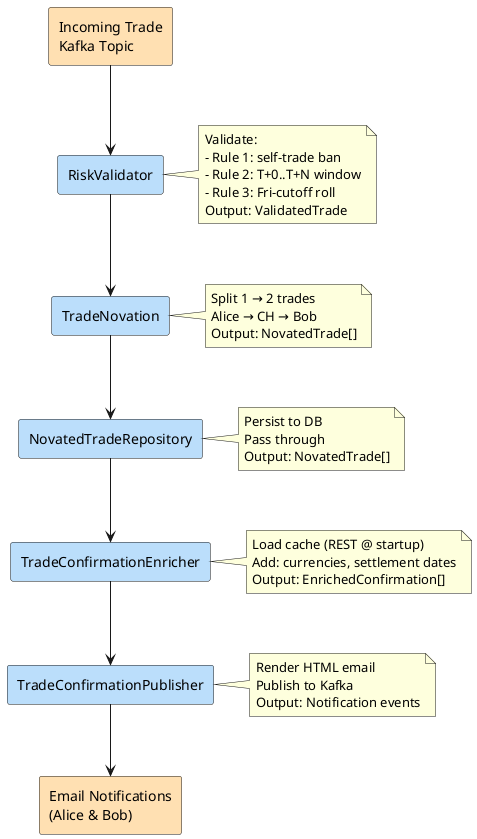

# Talk: Code Like a Machine, Test Like a Human
## Properties, Snapshots, Contracts, and Other Trust Exercises

---

## Abstract

AI generates code fast. Too fast. But here's the dirty secret: your tests can't keep up. You end up with hundreds of test cases that don't actually verify behavior — they just run green and lie to you. Flaky, shallow, and verbose, they give you confidence you haven't earned.

What if instead of writing more tests, you wrote smarter ones? Property-based testing forces you to reason about what your software should *always* do, not just what it does in one specific scenario. Contract testing draws clear boundaries between your services so AI-generated integrations can't silently break your clients. And snapshot testing makes every structural change — every email, every response — visible and reviewable, turning code review from a chore into a conversation.

You'll leave with a different way of thinking about testing — patterns that scale with AI velocity, make your code easier to review, and give you confidence in what you're actually shipping.

---

## Elevator Pitch

AI generates code at a pace our test suites weren't designed for. We ship faster, but we accumulate cognitive debt — we stop understanding our own systems. When AI writes the tests too, we end up with green, verbose, shallow suites that prove nothing. This talk introduces three trust exercises for your codebase: property-based testing to reason in invariants instead of examples, contract testing to keep AI-generated integrations from breaking clients, and snapshot testing to make every output change visible and reviewable. You'll leave testing smarter, not more.

---
    
## Title Options

| Context | Title | Subtitle |
|---|---|---|
| General dev conference | Code Like a Machine, Test Like a Human | Properties, Snapshots, Contracts, and Other Trust Exercises |
| Testing conference | Properties, Snapshots, Contracts, and Other Trust Exercises | Testing Strategies for the Age of AI-Generated Code |
| Alternative | 100% Coverage, 0% Confidence | Properties, Snapshots, Contracts, and Other Trust Exercises |

---

## Core Premise

AI helps us generate code faster than ever — but speed comes at a cost: **cognitive debt**. When AI writes not just the implementation but also the tests, we lose our understanding of what the codebase is actually doing. We end up with:

- Verbose, repetitive test cases that test nothing meaningful
- Flaky tests that give false confidence
- Green suites that don't catch real bugs

The answer isn't *more* tests. It's *smarter* ones — tests that force us to deeply understand our domain, our interfaces, and our outputs.

---

## Talk Structure

### 1. The Problem — Cognitive Debt in the Age of AI
- AI generates code fast; tests don't keep up
- AI-generated tests are often shallow, verbose, example-based
- Green ≠ correct; flaky ≠ useful
- We lose understanding of our own domain when AI does everything

### 2. Property-Based Testing
- Instead of specific examples, reason about *invariants* — things that should always be true
- Forces deeper thinking about domain rules and business logic
- Great fit for: pure functions, data transformations, domain models
- Tools: jqwik (Java), QuickCheck (Haskell origin, many ports)
- Demo idea: OrderService — "total price is always positive", "discount never exceeds original price"

### 3. Contract Testing
- Draw clear boundaries between services via consumer-driven contracts
- Producers prove they satisfy consumer expectations without end-to-end tests
- Especially relevant now: AI agents can discover and navigate contracts to safely generate integrations
- If contracts exist → agents can generate client code without breaking existing consumers
- Tools: Pact, Spring Cloud Contract
- Demo idea: REST API contract between OrderService and NotificationService

### 4. Snapshot Testing
- Capture the exact output of a component and assert it hasn't changed unexpectedly
- Makes *any* structural change explicit and reviewable — great for code review
- Especially powerful for: email templates, API responses, rendered HTML, serialized objects
- Changes become a conversation: "is this diff intentional?"
- Tools: Jest snapshots (JS), custom snapshot matchers (Java)
- Demo idea: snapshot test for an order confirmation email — any change to the email format is immediately visible in the diff

### 5. Payoff — Smarter Tests, Better Reviews, Less Cognitive Debt
- Each pattern forces you to understand your domain, not just write code
- Tests become documentation
- Code reviews become easier and more meaningful
- AI agents navigate safer interfaces

---

## Key Insight (the tweet-able idea)

> AI writes the code fast. Property-based, contract, and snapshot testing make sure you still understand what it does.

---

## Target Audience

- Java / Spring Boot developers working with AI-assisted development
- Teams adopting AI agents for code generation
- Anyone frustrated with shallow, verbose, AI-generated test suites

---

## Potential Demo Scenario

A simple **Order Management System** used as a running example throughout:

- **Property-based**: `placeOrder()` — invariants on price, quantity, status transitions
- **Contract**: REST contract between `OrderService` and `NotificationService`
- **Snapshot**: order confirmation email rendered as HTML — any change is caught

---

## Optional Extension (if time allows)

**Mutation Testing** — proves your test suite actually catches bugs by intentionally introducing small code mutations and checking whether the tests fail. Pairs beautifully with the talk's opening thesis: "green tests lie." Tools: PITest (Java).

---

## Speaker Notes

- This talk pairs well with the EDA / Consistency talk as a two-talk submission to the same conference
- The contract testing + AI agents angle is the most original insight — give it real stage time
- Consider a before/after slide: verbose AI-generated test vs. tight property-based equivalent
- "Cognitive debt" is the key term that ties the whole talk together — use it in the opening and revisit it in the closing

---

# Demo Project: Clearing House Trade Processing

## Overview

A realistic clearing house system that processes bilateral trades and interposes itself as the counterparty. The system validates incoming trades, splits them into two separate legs, persists them, enriches them with reference data, and sends confirmations to both parties.

Built with **Spring Boot 4**, **Java 25**, **Spring Cloud Stream**, and **Kafka** using a **Pipes and Filters** architecture.

## Use Case

A clearing house receives a bilateral trade between two counterparties (Alice and Bob). The system:

1. **Validates** the incoming trade against risk rules
2. **Novates** the trade — splits it into two legs so the clearing house interposes itself
3. **Persists** the novated trades to a database
4. **Enriches** the confirmations with static reference data (currencies, settlement dates, etc.)
5. **Publishes** confirmation notifications to both parties via email

## Architecture: Pipes and Filters

Each component is a filter in a data pipeline. Data flows through transformations at each stage:



## Components

| Component | Role | Input | Output |
|-----------|------|-------|--------|
| **RiskValidator** | Validates trade against three risk rules (see below) | `IncomingTrade` | `ValidatedTrade` or rejection |
| **TradeNovation** | Interposes clearing house; splits bilateral trade into two legs | `ValidatedTrade` | `NovatedTrade[]` (2 trades) |
| **NovatedTradeRepository** | Persists trades to database | `NovatedTrade[]` | `NovatedTrade[]` (pass-through) |
| **TradeConfirmationEnricher** | Loads static data (currencies, settlement info) from cache and enriches confirmations | `NovatedTrade[]` | `EnrichedConfirmation[]` |
| **TradeConfirmationPublisher** | Publishes HTML email confirmations to Kafka notification channel | `EnrichedConfirmation[]` | Published event |

## Validation Rules

The `RiskValidator` filter applies three rules in order. The first two reject the trade; the third rewrites the settlement date.

### Rule 1 — Self-trade ban
A trade where `party` and `counterparty` are the same entity (case-insensitive) is a self-trade and is rejected. Self-trades have no economic substance and are typically blocked by the clearing house to prevent wash-trade abuse.

### Rule 2 — T+0..T+N settlement window
The settlement date must lie within `[today, today + maxLag]` **business days**, where `maxLag` is set per currency (USD/EUR/GBP/JPY = T+2 by default). Past dates and dates beyond the window are rejected. This guards against late-bookings being smuggled in and unrealistically far-future settlements.

### Rule 3 — Friday-after-cutoff roll
Trades booked after **17:00 on a Friday** (or any time over the weekend) cannot settle before the following Monday. If the requested settlement date is earlier, it is rolled forward to the next Monday. The trade is *not* rejected — only the settlement date changes.

## Architecture Diagrams

See `flow.puml` for the pipes & filters data flow architecture and `sequence.puml` for the test execution sequence.

## Key Design Decisions

- **Pipes and Filters** — Each component transforms data and passes it to the next. Easy to test, compose, and reason about.
- **Spring Cloud Stream** — Natural fit for filter-based architecture; abstracts away Kafka configuration.
- **Functional Approach** — Use Java's `Supplier`, `Function`, and `Consumer` for clean, data-oriented transformations.
- **Static Data Cache** — Reference data (currencies, etc.) loaded at startup via REST call. Demonstrates contract testing.
- **Event-Driven** — Each stage publishes events for auditability and extensibility.

---

# Implementation

A multi-module Maven project with two Spring Boot microservices:

## Modules

### 1. `clearing-house` — Trade Clearing Service
Processes bilateral trades through a pipes-and-filters pipeline:
- **Port:** 8080
- **Database:** Embedded H2
- **Message Broker:** Kafka
- **Components:** RiskValidator → TradeNovation → NovatedTradeRepository → TradeConfirmationEnricher → TradeConfirmationPublisher

### 2. `currency-api` — Currency Reference Data Service
Serves currency information from static data:
- **Port:** 8081
- **Database:** None (in-memory from `currencies.json`)
- **Endpoints:** `GET /api/currencies`, `GET /api/currencies/{code}`
- **Purpose:** Contract-driven dependency for enrichment step; demonstrates dependency contracts

## Getting Started

See [PROJECT_SETUP.md](PROJECT_SETUP.md) for detailed instructions on building and running both services.

Quick start:
```bash
# Build both modules
./mvnw clean package

# Terminal 1: Start Kafka
cd clearing-house && docker-compose up -d

# Terminal 2: Start Currency API
./mvnw spring-boot:run -pl currency-api

# Terminal 3: Start Clearing House
./mvnw spring-boot:run -pl clearing-house

# Submit a trade
curl -X POST http://localhost:8080/api/trades \
  -H "Content-Type: application/json" \
  -d '{"tradeId":"T001","party":"Alice","counterparty":"Bob","amount":1000000,"currency":"USD","settlementDate":"2026-06-20"}'
```
